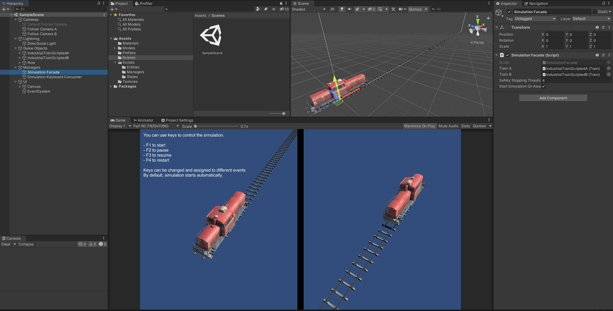

# unity-train-simulation
 A train simulation made for a job application. It consists of two trains that have to stop to prevent a crash. Both have different acceleration rates, max velocities and so on, and they are prevented from crashing by pure math and physics alone.

 

Play the simulation at https://yermides.itch.io/train-simulation
